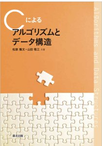

# Goによるアルゴリズムとデータ構造

以下の教科書の自習リポジトリです．プログラムは全て**Go**で実装します．

松原 雅文, 山田 敬三: **Cによるアルゴリズムとデータ構造**, 森北出版, 2021.

第01章　アルゴリズムとデータ構造  
第02章　代表的なソート  
第03章　比較によらないソート  
第04章　クイックソート  
第05章　スタックとキュー  
第06章　グラフ探索  
第07章　最短経路問題  
第08章　二分探索木  
第09章　線形連結リスト  
第10章　循環・重連結リスト  
第11章　線形探索，二分探索  
第12章　ハッシュ法  
第13章　文字列照合  
第14章　ヒープ  
第15章　ファイルのソート  
